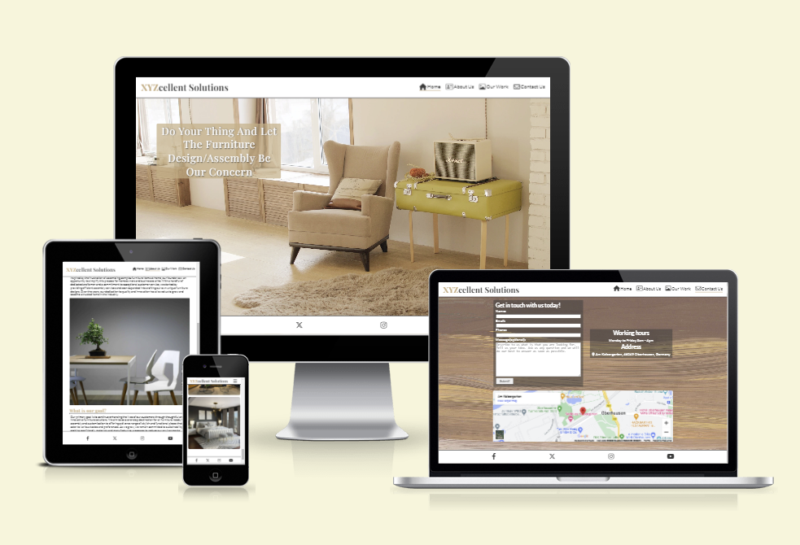
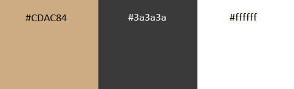
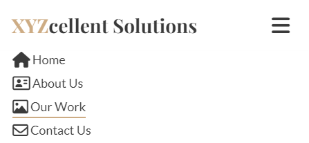
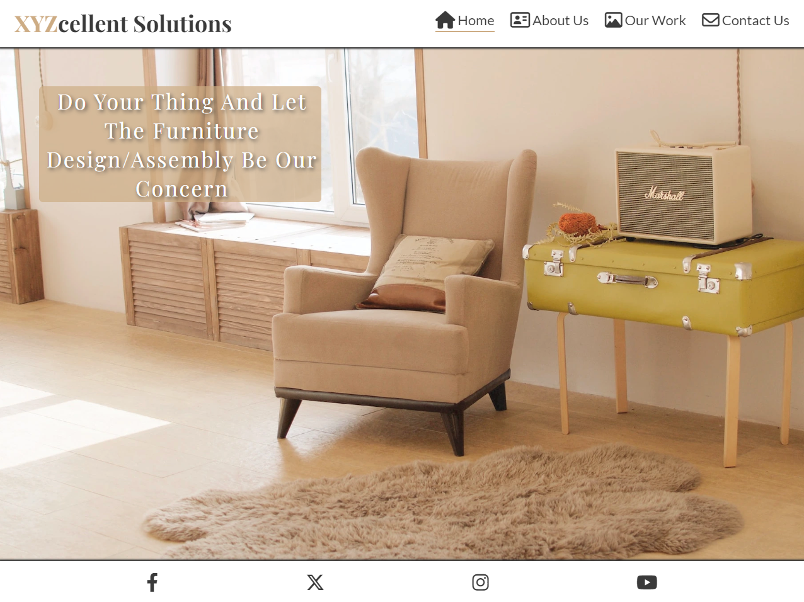
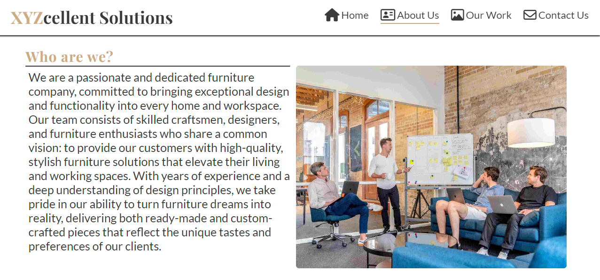
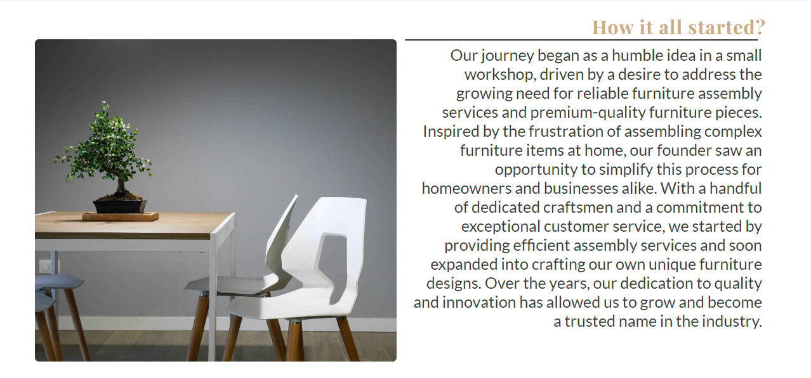
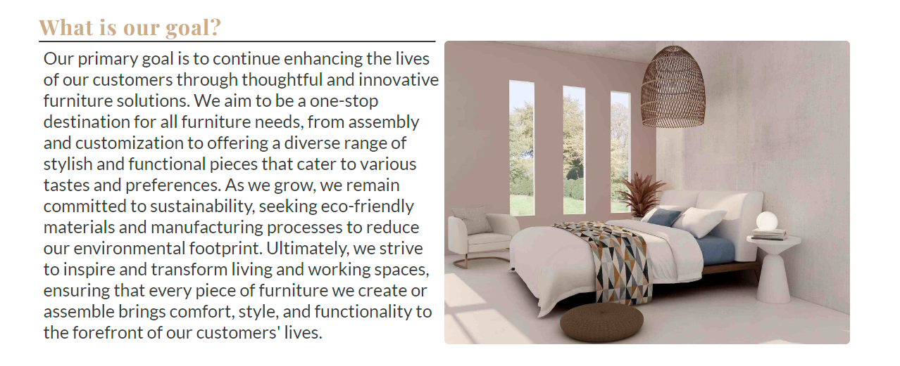
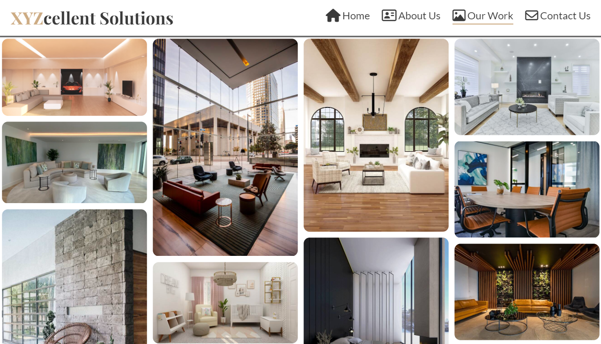
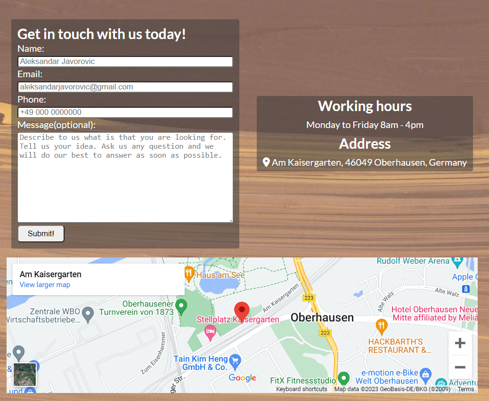
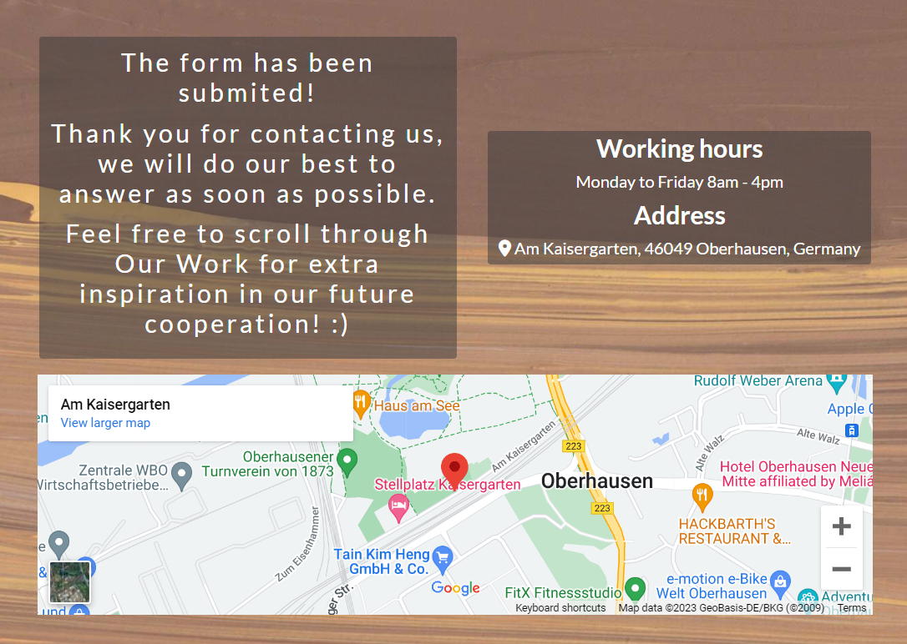

# XYZcellent Solutions

XYZcellent Solutions is an passionate, dedicated furniture company, consisting of young skilled craftsmen, designers and furniture enthusiasts who share same vision: providing high-quality, inovative, stylish furniture for our customers, which will decorate their living or working space.

As for our targeted group of customers, well, that can be literally anyone with a desire to change their living or working space for better.

[XYZcellent Solutions live project here.](https://aleksandarjavorovic.github.io/portfolio-project-1/)

## Table of Content

### [**User Experience (UX)**](#user-experience-ux)

- [User Stories](#user-stories)
- [Design](#design)
- [Wireframes](#wireframes)

### [**Features**](#features)

- [Header](#header)
- [Home Page](#home-page)
- [About Us Page](#about-us-page)
- [Our Work Page](#our-work-page)
- [Contact Us Page](#contact-us-page)
- [Thank You Page](#thank-you-page)
- [Footer](#footer)
- [Further Improvements](#further-improvements)

### [**Technologies Used**](#technologies-used)

- [Languages Used](#languages-used)
- [Frameworks, Libraries and Programs Used](#frameworks-libraries-and-programs-used)

### [**Testing**](#testing)

- [Validation Results](#validation-results)
- [Manual Testing](#manual-testing)
- [Fixed Bugs](#fixed-bugs)
- [Knows Bugs](#known-bugs)
- [Lighthouse Reports](#lighthouse-reports)

### [**Deployment and local development**](#deployment-and-local-development)

- [GitHub Pages](#github-pages)
- [Forking the GitHub Repository](#forking-the-github-repository)

### [**Credits**](#credits)
- [Content](#content)
- [Media](#media)

## **User Experience (UX)**

Goal of this site is to present our company and attract possible customers, those who would like to own exceptional, modern, stylish pieces of furniture.

The site itself is simple and easy to navigate, with a concise but effective message which welcomes the possible customer.

About Us and Our Work pages are there to present us, and show them what are we able to produce.

### **User Stories**

- **Visitor goals**

  - Understand who we are and what we do.
  - Easily navigate the site.
  - Get in touch with us via form or via our social networks.
  - Find the address if they are more of a old school type of person and would like to visit us in person.

- **Business owner goals**
  - Present our brand in the best possible way.
  - Attract possible customer by our previous work, which can be seen in our gallery.
  - Sell our services.
  - Keep the customer happy and satisfied as that ensures further cooperation and .attracts new costumers.

### **Design**

- **Color Scheme**

  - The colors I've used are #CDAC84, #3a3a3a and #ffffff. I went for relatively simple look without many colors.
  - 

- **Typography**

  - The fonts I've used are Lato and Playfair Display with a sans-serif as a backup font in case of importing issues.

- **Imagery**

  - The hero-image I've chosen with the elements on it represent an artistic approach to the furniture design. According to the image, I've chosen the colors I've used.

### **Wireframes**

- **Mobile Phone**
  

  
index.html
  

  
  

  

  
about-us.html
  

  
  

  

  
our-work.html
  

  
  

  

  
contact-us.html
  

  
  

  

  
thank-you.html
  

  
  

- **Tablet**

  

  
index.html
  

  
  

  

  
about-us.html
  

  
  

  

  
our-work.html
  

  
  

  

  
contact-us.html
  

  
  

  

  
thank-you.html
  

  
  

- **Desktop**

  

  
index.html
  

  
  

  

  
about-us.html
  

  
  

  

  
our-work.html
  

  
  

  

  
contact-us.html
  

  
  

  

  
thank-you.html
  

  
  

## **Features**

### **Header**

The website is built upon principles of responsive design, therefore the header, as well as other parts of site, look slightly different on devices with different screen sizes. Within the header we have company name(logo) on the left side, as well as navigation bar which contains 4 elements on bigger screens, on smaller screens is swaped with the so-called burger icon, which is drop-down menu. Elements of the header have naming and icon appropriate to the content which follows behind.

- **Mobile Phone**

when the burger button is pressed:

- **Desktop**

### **Home Page**

Do your thing and let the furniture design/assembly be our concern.

That's the phrase which welcomes the user landing on the home page. It is simple, straight to the point and it contains the keywords representing our services. That should be enough to get them interested and to know we are one-stop destination for all furniture needs.

### **About Us Page**

Name of the page tells us more or less everything what user can expect here. About us page is here to introduce XYZcellent Solutions to the future customer and let him know something more about the company, our goals etc.

Here we have three sections:

1. **Who are we?**

2. **How it all started?**

3. **What is our goal?**

### **Our Work Page**

Guided by the saying:"a picture says more than a thousand words", at this page are many photos which show our previous work and give the user an idea of our capabilities.

### **Contact Us Page**

Hoping that we have sparked the desire of users to buy our services, at this page is everything they need to get in touch with us and that is:

- Form to fill in and leave message/question if desired.
- Our address with working times.
- Extra iframe of google maps for easier navigation.

### **Thank You Page**

This page is very similar to Contact Us, only difference is that instead of form, there is a message that form has been submited. To achieve this I had to change method to GET.

### **Footer**

The footer itself is pretty basic but yet functional. It contains links to social networks presented in a form of icons. The links will pop up in new tabs as instructed by our teachers.

- **Mobile Phones**

- **Desktop**

### **Further Improvements**

- Add more content to our work page on a regular basis.
- Add extra page about techniques and materials being used.
- Add phone number to the contact us page(don't know how I forgot about that).
- Add copyright and company logo to the footer for more professional look.
- Fix any further bugs discovered after final deployment.

## **Technologies Used**

### **Languages Used**

- HTML5
- CSS3

### **Frameworks, Libraries and Programs Used**

1. [Google Fonts](https://fonts.google.com/)
   - Used to import "Lato" and "Playfiar Display" fonts into the style.css file.
2. [Font Awesome](https://fontawesome.com/)
   - Used to add icons for UX and aesthetic purposes.
3. [Favicon.io](https://favicon.io/)
   - Used to create favicon for the website.
4. [Git](https://git-scm.com/)
   - Used for version control, commit to Git and Push to GitHub.
5. [GitHub](https://github.com/)
   - Used to store the code online and for deployment.
6. [Balsamiq](https://balsamiq.com/)
   - Used to create frames for the site in the designing process.
7. [Am I Responsive](https://ui.dev/amiresponsive)
   - Used to create mockup image for the README file.
8. [Simple Image Resizer](https://www.simpleimageresizer.com/)
   - Used to resize/compress images.
9. [Red Ketchup](https://redketchup.io/)
   - Used to crop images.

## **Testing**

The W3C Markup Validator and W3C CSS Validator Services were used to validate every page of the project to ensure there were no syntax errors in the project.

- [W3C Markup Validator](https://validator.w3.org/)
- [W3C CSS Validator](https://jigsaw.w3.org/css-validator/)

### **Validation Results**

  

  
index.html
  

  
  
  

  

  
about-us.html
  

  
  
  

  

  
our-work.html
  

  
  
  

  

  
contact-us.html
  

  
  
  

  

  
thank-you.html
  

  
  
  

  

  
style.css
  

  
  
  

### **Manual Testing**

- The site was tested on variaty of browsers such as: [Brave](https://brave.com/), [Microsoft Edge](https://www.microsoft.com/en-us/edge?ep=82&form=MA13KI&es=24&ch=1), [Opera GX](https://www.opera.com/gx) and [Safari](https://www.apple.com/safari/).
- The site was tested on variaty of devides as well: Desktop PC, Laptop, Xiaomi12T, Iphone14. Thanks to responsive design approach the site looks lood on all devices.
- Links between pages as well as links to social networks were tested to ensure there are no issues.
- Family members were asked kindly to try to use the site for additional feedback.

### **Fixed Bugs**

- At the Index and Our Work page had to change section to div to avoid warning while validating those html files.

### **Known Bugs**

- When testing responsivity and the width < 250px, at the contact us page the background is being pushed up, so that white appears instead.

### **Lighthouse Reports**

#### **Mobile Analysis**

Home Page

  

  

About Us Page

  

Our Work Page

  

Contact Us Page

  

Thank You Page

  

#### **Desktop Analysis**

Home Page

  

About Us Page

  

Our Work Page

  

Contact Us Page

  

Thank You Page

  

## **Deployment and local development**

### **GitHub Pages**

1. Log in to GitHub and locate [GitHub Repository XYZcellent Solutions](https://github.com/AleksandarJavorovic/portfolio-project-1)
2. At the navigation bar of the repository tab find "Settings", click.
3. At the left side under the "Code and automation" section, click on "Pages".
4. Next locate the "Source" and set it to "Deploy from a branch", branch should be "main", folder set to "root" and then click on the "Save" button.
5. Head back to the [Project Repository](https://github.com/AleksandarJavorovic/portfolio-project-1) and on the right side click on [Deployments](https://github.com/AleksandarJavorovic/portfolio-project-1/deployments) and under the "Active deployments" section is the freshly deployed project: [XYZcellent Solutions](<https://aleksandarjavorovic.github.io/portfolio-project-1/>).

### **Forking the GitHub Repository**

By forking the GitHub Repository we can make a copy of the original repository to view or make changes without changing the original repository.

1. Log in to GitHub and locate [GitHub Repository XYZcellent Solutions](https://github.com/AleksandarJavorovic/portfolio-project-1)
2. At the top, in the line with the project's name, on the right side find "Fork", click.
3. Now you have a copy of the original repository in your GitHub account.

## **Credits**

Thanks to my mentor Mitko Bachvarov for usefull tips and answers to all of my questions.

### **Content**

- Many things were inspired by Love Running project
- [A Complete Guide to Flexbox](https://css-tricks.com/snippets/css/a-guide-to-flexbox/) contributed a lot to understanding of the concept of flexbox.
- Inspiration for README file I found in these three exemples:
  * [Lunar Escape](https://github.com/Thomas-Tomo/Lunar-Escape/blob/main/README.md#deployment-and-local-development-1)
  * [Furry Friends Shelter](https://github.com/Julia-Wagner/furry-friends/blob/main/README.md#furry-friends-shelter)
  - [Code Institute Website](https://github.com/Code-Institute-Solutions/SampleREADME)
- Enlarging effect of icons inspired by: [Increase text size on hover](https://stackoverflow.com/questions/48388963/increase-text-size-on-hover)
- Text-shadow effect for the main text is from: [CSS Shadow Effects](https://www.w3schools.com/css/css3_shadows.asp)
- Text at About Us page written by(inspired by me): [ChatGPT](https://openai.com/chatgpt)
- Inspiration for media queries taken from: [Media min-width & max-width](https://stackoverflow.com/questions/13550541/media-min-width-max-width)

### **Media**

- Photos used are taken from: [Unsplash](https://unsplash.com/)
- Google map iframe inspired by: [How to Embed Google Map in HTML](https://blog.hubspot.com/website/how-to-embed-google-map-in-html)
