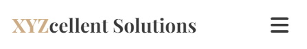
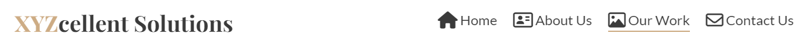

# XYZcellent Solutions

XYZcellent Solutions is an passionate, dedicated furniture company, consisting of young skilled craftsmen, designers and furniture enthusiasts who share same vision: providing high-quality, inovative, stylish furniture for our customers, which will decorate their living or working space.

As for our targeted group of customers, well, that can be literally anyone with a desire to change their living or working space for better.

[XYZcellent Solutions live project here.](https://aleksandarjavorovic.github.io/portfolio-project-1/)

## Table of Content

 ### [User Experience (UX)](#user-experience-ux)
  * [User Stories](#user-stories)
  * [Design](#design)
  * [Wireframes](#wireframes)

 ### [Features](#features)

 ### [Technologies Used](#technologies-used)

 ### [Frameworks, Libraries and Programs Used](#frameworks-libraries-and-programs-used)

 ### [Testing](#testing)

 ### [Deployment and local development](#deployment-and-local-development)

  ### [Credits](#credits)

 ### [Aknowledgements](#aknowledgements)

## **User Experience (UX)**

Goal of this site is to present our company and attract possible customers, those who would like to own exceptional, modern, stylish pieces of furniture. 

The site itself is simple and easy to navigate, with a concise but effective message which welcomes the possible customer.

About Us and Our Work pages are there to present us, and show them what are we able to produce.

### **User Stories**

* **Visitor goals**
  * Understand who we are and what we do
  * Easily navigate the site
  * Get in touch with us via form or via our social networks
  * Find the address if they are more of a old school type of person and would like to visit us in person

* **Business owner goals**
  * Present our brand in the best possible way
  * Attract possible customer by our previous work, which can be seen in our gallery
  * Sell our services
  * Keep the customer happy and satisfied as that ensures further cooperation and attracts new costumers

### **Design**

* **Color Scheme**

  * The colors I've used are #CDAC84, #3a3a3a and #ffffff. I went for relatively simple look without many colors.
  * 
* **Typography**

  * The fonts I've used are Lato and Playfair Display with a sans-serif as a backup font in case of importing issues. 
  
* **Imagery**

  * The hero-image I've chosen with the elements on it represent an artistic approach to the furniture design. According to the image, I've chosen the colors I've used.
  
### **Wireframes**

* **Mobile Phone**
  

  
index.html
  

  
  
  

  

  
about-us.html
  

  
  

  
  

  
our-work.html
  

  
  

  

  
contact-us.html
  

  
  

  

  
thank-you.html
  

  
  
  

* **Tablet**

  

  
index.html
  

  
  
  

  

  
about-us.html
  

  
  
  

  

  
our-work.html
  

  
  
  

  

  
contact-us.html
  

  
  
  

  

  
thank-you.html
  

  
  
  

* **Desktop**

  

  
index.html
  

  
  
  

  

  
about-us.html
  

  
  
  

  

  
our-work.html
  

  
  
  

  

  
contact-us.html
  

  
  
  

  

  
thank-you.html
  

  
  
  

## **[Features](#features)**

### **Header**
The website is built upon principles of responsive design, therefore the header, as well as other parts of site, look slightly different on devices with different screen sizes. Within the header we have company name(logo) on the left side, as well as navigation bar which contains 4 elements on bigger screens, on smaller screens is swaped with the so-called burger icon, which represents drop-down menu. Elements of the header have naming and icon appropriate to the content which follows behind.

* **Mobile Phone**

when the burger button is pressed:

* **Desktop**

